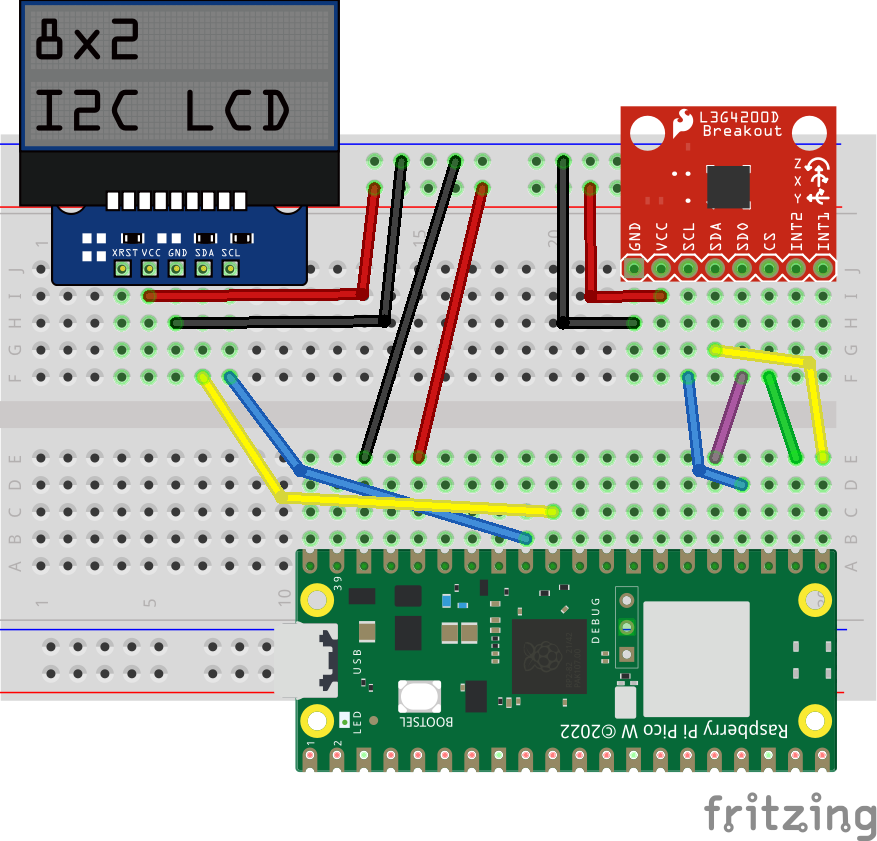

# Pico W examples

Sensor-wired versions of the top-level demos. Their peers are the top-level
observer and central.

## Broadcaster



### Pin assign
  * 3V3 to {LCD,THERMO}:VCC
  * GND to {LCD,THERMO}:GND
  * GPIO16 to THERMO:SDO
  * GPIO17 to THERMO:CS
  * GPIO18 to THERMO:SCL
  * GPIO19 to THERMO:SDI
  * GPIO26 to LCD:SDA
  * GPIO27 to LCD:SCL

### Source

```console
/home/app.rb
/lib/lcd.rb
/lib/thermo.rb
```

## Peripheral

No wiring needed.

### Source

```console
/home/app.rb
```
